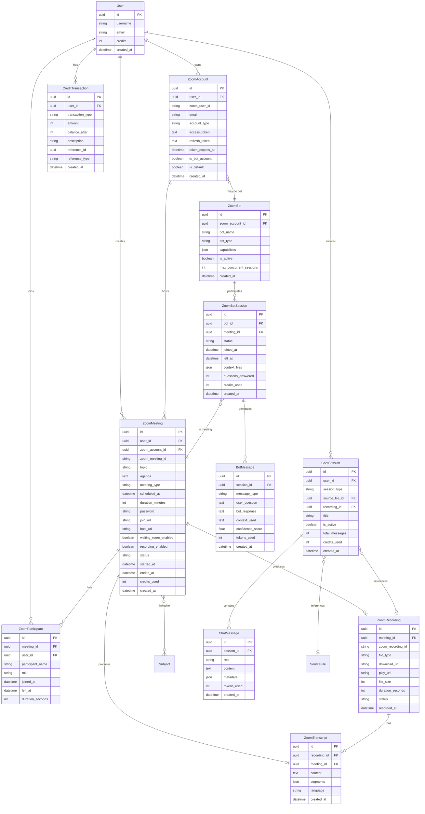
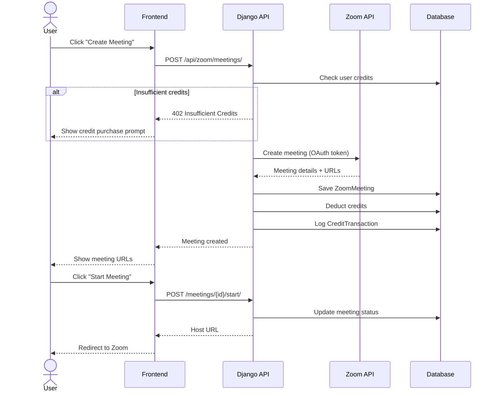
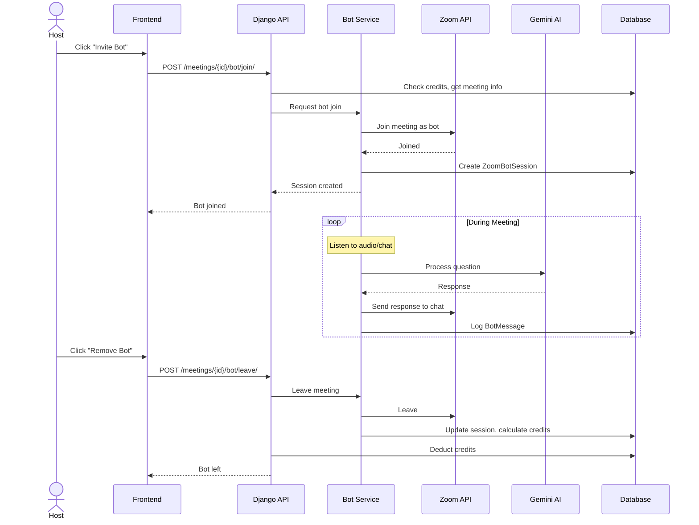
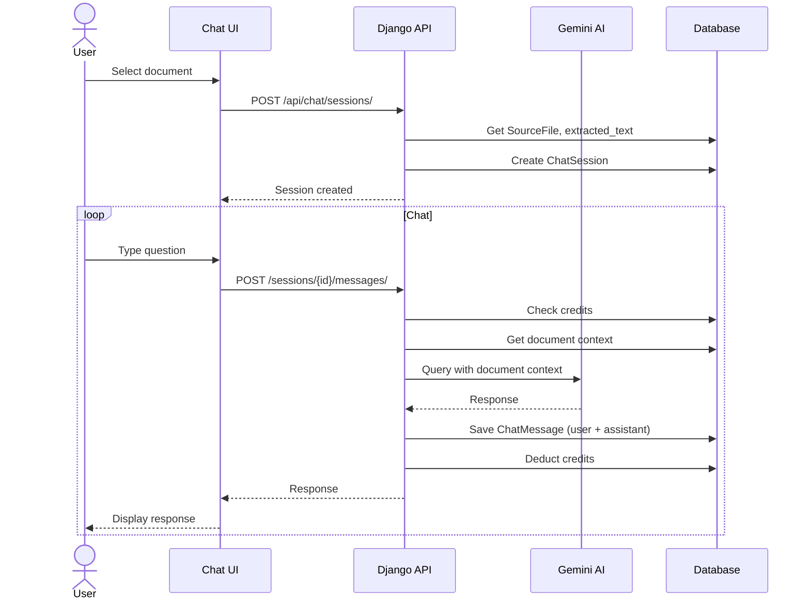
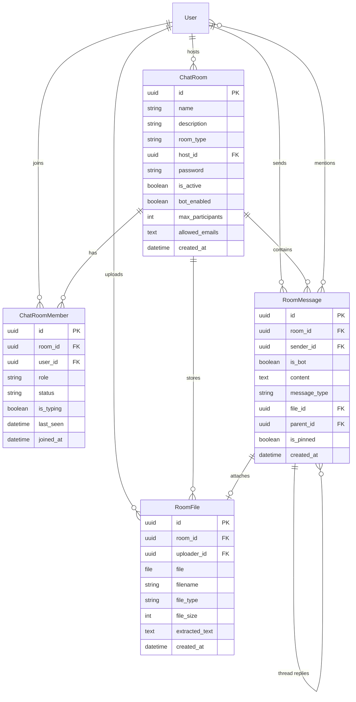

# SYSTEM DESIGN REPORT: Zoom Management & AI Bot Learning System

## Executive Summary

### Project Goal

Mở rộng hệ thống MCQ Generator hiện có bằng cách thêm **Zoom Management Module** - cho phép người dùng:

- **Quản lý nhiều tài khoản Zoom** với các cấp độ quyền khác nhau
- **Tạo và tham gia phòng học Zoom** tích hợp với hệ thống
- **Học với AI Bot** - Bot tham gia phòng Zoom để hỗ trợ học tập
- **Chat với tài liệu & video** - AI hỗ trợ Q&A dựa trên tài liệu đã upload và video recordings
- **Phân phối credit** cho các hoạt động Zoom

### Deep Reasoning (Requirement Expansion)

Từ yêu cầu chung "quản lý zoom, tạo zoom, join zoom", tôi đã phân tích sâu các nhu cầu thực tế:

1. **Account Management**:
   - Hỗ trợ nhiều tài khoản Zoom (personal, organization)
   - OAuth2 integration với Zoom API
   - Token refresh handling
   - Account quota tracking

2. **Meeting Lifecycle**:
   - Create → Schedule → Host → Join → Record → End → Archive
   - Password/Waiting room security
   - Participant management

3. **AI Bot Integration**:
   - Bot account riêng để tham gia meetings
   - Real-time transcription
   - Q&A support during meetings
   - Post-meeting summary generation

4. **Credit System Extension**:
   - Credits cho meeting minutes
   - Credits cho AI Bot usage
   - Credits cho video/doc Q&A
   - Tiered pricing model

---

## Feature Breakdown

### 1. Zoom Account Module

| Feature | Description | Priority |
|---------|-------------|----------|
| Multi-account support | Liên kết nhiều tài khoản Zoom với 1 user | High |
| OAuth2 Flow | Zoom OAuth2 authorization | High |
| Token Management | Secure storage, auto-refresh tokens | High |
| Account Quota | Track meeting limits, storage | Medium |
| Default Account | Chọn tài khoản mặc định | Medium |

### 2. Meeting Management Module

| Feature | Description | Priority |
|---------|-------------|----------|
| Create Meeting | Tạo instant/scheduled meetings | High |
| Join Meeting | Join với meeting ID + password | High |
| Meeting Templates | Lưu cấu hình meeting thường dùng | Medium |
| Waiting Room | Quản lý phòng chờ | Medium |
| Recording | Cloud/Local recording options | Medium |
| Participant Management | Mute, kick, promote | Low |

### 3. AI Bot Learning Module

| Feature | Description | Priority |
|---------|-------------|----------|
| Bot Account | Tài khoản bot riêng để join meetings | High |
| Auto-Join | Bot tự động join khi được mời | High |
| Live Transcription | Real-time speech-to-text | High |
| Q&A During Meeting | Học sinh hỏi, bot trả lời | High |
| Document Context | Bot tham chiếu tài liệu đã upload | High |
| Meeting Summary | Tóm tắt sau meeting | Medium |

### 4. Chat with Docs & Video Module

| Feature | Description | Priority |
|---------|-------------|----------|
| Doc Q&A | Hỏi đáp dựa trên tài liệu | High |
| Video Q&A | Hỏi về nội dung video recording | Medium |
| Transcript Search | Tìm kiếm trong transcript | Medium |
| Context Window | Tuỳ chỉnh context cho AI | Low |

### 5. Credit Distribution System

| Action | Credits Cost | Rationale |
|--------|-------------|-----------|
| Create Meeting | 2 credits | One-time setup cost |
| Host Meeting (per 30 min) | 5 credits | Ongoing resource usage |
| Bot Join (per 30 min) | 10 credits | AI processing cost |
| Transcription (per hour) | 15 credits | Speech-to-text cost |
| Doc Q&A (per question) | 2 credits | API call cost |
| Video Q&A (per question) | 3 credits | Heavier processing |
| Meeting Summary | 5 credits | AI summarization |

---

## Database Architecture

### ERD Diagram



### New Models Description

#### ZoomAccount

Lưu trữ thông tin tài khoản Zoom được liên kết. Hỗ trợ OAuth2 với access/refresh tokens.

#### ZoomMeeting

Thông tin meeting bao gồm cấu hình, URL join/host, trạng thái, và credits đã sử dụng.

#### ZoomParticipant

Theo dõi ai đã tham gia meeting và thời lượng tham gia.

#### ZoomRecording

Lưu trữ recording từ Zoom cloud, bao gồm URL download và metadata.

#### ZoomTranscript

Transcript từ recordings hoặc real-time transcription, lưu dạng segments JSON để dễ tìm kiếm.

#### ZoomBot

Cấu hình bot account - loại bot, capabilities, giới hạn concurrent sessions.

#### ZoomBotSession

Mỗi lần bot tham gia 1 meeting là 1 session. Track context files, số câu hỏi đã trả lời.

#### BotMessage

Log từng câu hỏi/trả lời của bot trong meeting.

#### ChatSession & ChatMessage

Chat với tài liệu hoặc video recording. Mỗi session liên kết với 1 source file hoặc 1 recording.

#### CreditTransaction

Audit trail cho mọi credit transactions (earn, spend).

---

## API Strategy

### Zoom Account Endpoints

| Method | Endpoint | Description |
|--------|----------|-------------|
| GET | `/api/zoom/accounts/` | List user's Zoom accounts |
| POST | `/api/zoom/accounts/connect/` | Initiate OAuth2 flow |
| GET | `/api/zoom/accounts/callback/` | OAuth2 callback |
| DELETE | `/api/zoom/accounts/{id}/` | Disconnect account |
| PATCH | `/api/zoom/accounts/{id}/default/` | Set as default |

### Meeting Endpoints

| Method | Endpoint | Description |
|--------|----------|-------------|
| GET | `/api/zoom/meetings/` | List meetings |
| POST | `/api/zoom/meetings/` | Create meeting |
| GET | `/api/zoom/meetings/{id}/` | Get meeting details |
| PATCH | `/api/zoom/meetings/{id}/` | Update meeting |
| DELETE | `/api/zoom/meetings/{id}/` | Delete meeting |
| POST | `/api/zoom/meetings/{id}/start/` | Start meeting |
| POST | `/api/zoom/meetings/{id}/end/` | End meeting |
| GET | `/api/zoom/meetings/{id}/join-url/` | Get join URL |

### Bot Endpoints

| Method | Endpoint | Description |
|--------|----------|-------------|
| POST | `/api/zoom/meetings/{id}/bot/join/` | Request bot to join |
| POST | `/api/zoom/meetings/{id}/bot/leave/` | Request bot to leave |
| GET | `/api/zoom/bot/sessions/` | List bot sessions |
| GET | `/api/zoom/bot/sessions/{id}/messages/` | Get bot messages |

### Recording & Transcript Endpoints

| Method | Endpoint | Description |
|--------|----------|-------------|
| GET | `/api/zoom/recordings/` | List recordings |
| GET | `/api/zoom/recordings/{id}/` | Get recording details |
| GET | `/api/zoom/recordings/{id}/transcript/` | Get transcript |
| POST | `/api/zoom/recordings/{id}/transcribe/` | Request transcription |

### Chat Endpoints

| Method | Endpoint | Description |
|--------|----------|-------------|
| GET | `/api/chat/sessions/` | List chat sessions |
| POST | `/api/chat/sessions/` | Create chat session |
| GET | `/api/chat/sessions/{id}/` | Get session with messages |
| POST | `/api/chat/sessions/{id}/messages/` | Send message |
| DELETE | `/api/chat/sessions/{id}/` | Delete session |

### Credit Endpoints

| Method | Endpoint | Description |
|--------|----------|-------------|
| GET | `/api/credits/balance/` | Get current balance |
| GET | `/api/credits/transactions/` | List transactions |
| POST | `/api/credits/purchase/` | Purchase credits |

---

## Component Architecture

### Navigation Update

```
├── Dashboard (existing)
├── MCQ Generator (existing)
├── History (existing)
├── Zoom (NEW)
│   ├── Accounts
│   │   ├── List connected accounts
│   │   └── Connect new account (OAuth)
│   ├── Meetings
│   │   ├── Create Meeting
│   │   ├── My Meetings (list)
│   │   ├── Join Meeting
│   │   └── Meeting Details
│   │       ├── Participants
│   │       ├── Recordings
│   │       └── Transcript
│   └── Bot
│       ├── Bot Settings
│       ├── Active Sessions
│       └── Session History
├── Chat (NEW)
│   ├── Chat with Document
│   └── Chat with Video
├── Credits (NEW)
│   ├── Balance
│   ├── Transaction History
│   └── Purchase Credits
└── Profile (existing)
```

### Template Structure

```
templates/
├── zoom/
│   ├── accounts/
│   │   ├── list.html
│   │   └── connect.html
│   ├── meetings/
│   │   ├── list.html
│   │   ├── create.html
│   │   ├── join.html
│   │   └── detail.html
│   └── bot/
│       ├── settings.html
│       └── sessions.html
├── chat/
│   ├── session.html
│   └── history.html
└── credits/
    ├── balance.html
    └── purchase.html
```

---

## Data Flow Diagrams

### Create & Join Meeting Flow



### Bot Join Meeting Flow



### Chat with Document Flow



---

## Security Considerations

### OAuth2 Token Storage

- Access tokens và refresh tokens được encrypt trước khi lưu DB
- Sử dụng Django's `Fernet` encryption
- Token rotation mỗi khi refresh

### Meeting Security

- Password required by default
- Waiting room enabled by default
- Bot chỉ join khi host explicitly invite

### Rate Limiting

- API rate limiting với `django-ratelimit`
- Zoom API rate limit handling với exponential backoff

### Credit Security

- Atomic transactions cho credit operations
- Audit trail với CreditTransaction
- Fraud detection cho unusual patterns

---

## Risk Assessment

| Risk | Impact | Mitigation |
|------|--------|------------|
| Zoom API rate limits | High | Caching, request queuing, exponential backoff |
| Token expiration mid-meeting | High | Proactive token refresh, offline fallback |
| Bot audio processing latency | Medium | Queue processing, async responses |
| Credit fraud | Medium | Transaction logging, anomaly detection |
| Transcript accuracy | Medium | Multiple ASR providers, manual correction |
| Concurrent bot sessions overload | Medium | Session limits, load balancing |

---

## Feature Update: Internal Chat Room System (Zoom-like)

Date: 2026-01-06

### Executive Summary

Tạo hệ thống phòng chat nội bộ kiểu Zoom với đầy đủ tính năng:

- **Dashboard quản lý phòng**: Danh sách phòng, filter/search, phòng gần đây
- **Group Chat**: Thread, mention, emoji, ghim tin nhắn
- **Chatbot tích hợp**: Bật/tắt bot, lệnh điều khiển, fake responses
- **File Interaction (RAG Mode)**: Chat với file, trích xuất thông tin
- **Phân quyền & Thông báo**: Host/Member roles, notifications

### New Models

#### ChatRoom (Phòng chat)

| Field              | Type          | Description                       |
|--------------------|---------------|-----------------------------------|
| id                 | UUID          | Primary key                       |
| name               | CharField     | Tên phòng (max 200)               |
| description        | TextField     | Mô tả ngắn                        |
| room_type          | CharField     | community/work/ai_deep            |
| host               | FK → User     | Chủ phòng                         |
| password           | CharField     | Mật khẩu (blank = public)         |
| is_active          | Boolean       | Phòng đang hoạt động              |
| bot_enabled        | Boolean       | Bật/tắt chatbot                   |
| max_participants   | Integer       | Giới hạn số người (default 50)    |
| allowed_emails     | TextField     | Email được phép (JSON list)       |
| created_at         | DateTime      | Thời gian tạo                     |

#### ChatRoomMember (Thành viên)

| Field      | Type          | Description                          |
|------------|---------------|--------------------------------------|
| id         | UUID          | Primary key                          |
| room       | FK → ChatRoom | Phòng                                |
| user       | FK → User     | Thành viên                           |
| role       | CharField     | host/moderator/member                |
| status     | CharField     | online/away/busy/offline             |
| is_typing  | Boolean       | Đang soạn tin                        |
| last_seen  | DateTime      | Lần cuối hoạt động                   |
| joined_at  | DateTime      | Thời gian tham gia                   |

#### RoomMessage (Tin nhắn)

| Field       | Type            | Description                      |
|-------------|-----------------|----------------------------------|
| id          | UUID            | Primary key                      |
| room        | FK → ChatRoom   | Phòng                            |
| sender      | FK → User       | Người gửi (null = bot)           |
| is_bot      | Boolean         | Tin nhắn từ bot                  |
| content     | TextField       | Nội dung tin nhắn                |
| message_type| CharField       | text/file/system                 |
| file        | FK → RoomFile   | File đính kèm (optional)         |
| parent      | FK → Self       | Thread reply (optional)          |
| is_pinned   | Boolean         | Ghim tin nhắn                    |
| mentions    | ManyToMany User | Danh sách người được mention     |
| created_at  | DateTime        | Thời gian gửi                    |

#### RoomFile (File trong phòng)

| Field        | Type           | Description                    |
|--------------|----------------|--------------------------------|
| id           | UUID           | Primary key                    |
| room         | FK → ChatRoom  | Phòng                          |
| uploader     | FK → User      | Người upload                   |
| file         | FileField      | File path                      |
| filename     | CharField      | Tên file gốc                   |
| file_type    | CharField      | pdf/docx/image/other           |
| file_size    | Integer        | Dung lượng (bytes)             |
| extracted_text | TextField    | Văn bản trích xuất (cho RAG)   |
| created_at   | DateTime       | Thời gian upload               |

### New Endpoints

#### Room Management

| Method | Endpoint               | Description                    |
|--------|------------------------|--------------------------------|
| GET    | `/rooms/`              | Dashboard - Danh sách phòng    |
| GET    | `/rooms/recent/`       | Phòng đã tham gia gần đây      |
| POST   | `/rooms/create/`       | Tạo phòng mới                  |
| GET    | `/rooms/<id>/`         | Trang chat phòng               |
| POST   | `/rooms/<id>/join/`    | Tham gia phòng (check password)|
| POST   | `/rooms/<id>/leave/`   | Rời phòng                      |
| PATCH  | `/rooms/<id>/settings/`| Cập nhật cài đặt phòng         |
| DELETE | `/rooms/<id>/`         | Xóa phòng (host only)          |

#### Chat API

| Method | Endpoint                       | Description                     |
|--------|--------------------------------|---------------------------------|
| GET    | `/api/rooms/<id>/messages/`    | Lấy tin nhắn (polling)          |
| POST   | `/api/rooms/<id>/messages/`    | Gửi tin nhắn                    |
| GET    | `/api/rooms/<id>/messages/<mid>/thread/` | Lấy thread replies     |
| POST   | `/api/rooms/<id>/messages/<mid>/pin/`    | Ghim/bỏ ghim tin nhắn  |
| GET    | `/api/rooms/<id>/members/`     | Danh sách thành viên + status   |
| POST   | `/api/rooms/<id>/typing/`      | Cập nhật trạng thái "đang gõ"   |

#### File API

| Method | Endpoint                        | Description                    |
|--------|---------------------------------|--------------------------------|
| GET    | `/api/rooms/<id>/files/`        | Danh sách file (File Gallery)  |
| POST   | `/api/rooms/<id>/files/`        | Upload file                    |
| GET    | `/api/rooms/<id>/files/<fid>/`  | Xem file preview               |
| POST   | `/api/rooms/<id>/files/<fid>/chat/` | Chat với file (RAG Mode)   |
| DELETE | `/api/rooms/<id>/files/<fid>/`  | Xóa file (host/uploader only)  |

#### Bot API

| Method | Endpoint                    | Description                    |
|--------|-----------------------------|--------------------------------|
| POST   | `/api/rooms/<id>/bot/toggle/` | Bật/tắt bot trong phòng       |
| POST   | `/api/rooms/<id>/bot/command/`| Gửi lệnh bot (/summary, /help)|

### ERD Update



### UI Layout

#### 1. Dashboard (Room Listing)

```
┌─────────────────────────────────────────────────────────────────────────┐
│  🏠 Phòng Chat                                          [+ Tạo phòng]   │
├─────────────────────────────────────────────────────────────────────────┤
│  🔍 Tìm kiếm...    [Tất cả ▼] [Công khai ▼] [Đã tham gia ▼]            │
├──────────────────────────────────┬──────────────────────────────────────┤
│  📋 Phòng đang hoạt động (Live)  │  🕐 Phòng gần đây                    │
│  ┌─────────────────────────────┐ │  • Phòng ABC - 2 giờ trước          │
│  │ 💬 Phòng Học Nhóm    🔒     │ │  • Phòng XYZ - 1 ngày trước         │
│  │ 👥 12 online  🤖 Bot ON     │ │  • Phòng 123 - 3 ngày trước         │
│  │ [Tham gia]                  │ │                                      │
│  └─────────────────────────────┘ │                                      │
│  ┌─────────────────────────────┐ │                                      │
│  │ 💼 Phòng Công việc          │ │                                      │
│  │ 👥 5 online   🤖 Bot OFF    │ │                                      │
│  │ [Tham gia]                  │ │                                      │
│  └─────────────────────────────┘ │                                      │
└──────────────────────────────────┴──────────────────────────────────────┘
```

#### 2. Chat Room Interface

```
┌─────────────────────────────────────────────────────────────────────────┐
│  💬 Phòng Học Nhóm   👥 12   🤖 ON  ⚙️  [Rời phòng]                     │
├───────────────────────────────────────────┬─────────────────────────────┤
│                                           │  Thành viên (12)            │
│  📌 Ghim: "Mật khẩu WiFi: abc123"        │  ┌─────────────────────────┐ │
│  ─────────────────────────────────        │  │ 🟢 Nguyễn Văn A (Host)  │ │
│                                           │  │ 🟢 Trần Thị B           │ │
│  [Avatar] Nguyễn Văn A - 10:30            │  │ 🟡 Lê Văn C (Away)      │ │
│  Xin chào mọi người!                      │  │ 🔴 Phạm D (Busy)        │ │
│      ↪ 3 phản hồi...                      │  │ ⚪ Hoàng E (Offline)    │ │
│                                           │  └─────────────────────────┘ │
│  [🤖] Bot - 10:31                         │                             │
│  Chào bạn! Tôi có thể giúp gì?            │  📁 File đã chia sẻ (3)     │
│                                           │  ┌─────────────────────────┐ │
│  [Avatar] Trần Thị B - 10:32              │  │ 📄 Báo_cáo.pdf          │ │
│  @Nguyễn Văn A check file nhé 📎         │  │ 📊 Data.xlsx            │ │
│                                           │  │ 🖼️ Diagram.png         │ │
│  Trần Thị B đang soạn tin...             │  │ [Chat với file]         │ │
│                                           │  └─────────────────────────┘ │
├───────────────────────────────────────────┴─────────────────────────────┤
│  📎  😀  | Nhập tin nhắn... @mention /command          [Gửi]           │
└─────────────────────────────────────────────────────────────────────────┘
```

#### 3. Chat with File (RAG Mode)

```
┌─────────────────────────────────────────────────────────────────────────┐
│  📄 Báo_cáo_2026.pdf                                    [✕ Đóng]        │
├─────────────────────────────────┬───────────────────────────────────────┤
│                                 │  💬 Chat với File                     │
│  ┌───────────────────────────┐  │  ────────────────────────────        │
│  │                           │  │  [🤖] Tôi đã đọc file. Hỏi gì đi!    │
│  │   [PDF PREVIEW]           │  │                                       │
│  │                           │  │  [👤] Tóm tắt file này cho tôi        │
│  │   Doanh thu năm 2026      │  │                                       │
│  │   tăng trưởng 20%...      │  │  [🤖] Dựa trên tài liệu:              │
│  │                           │  │  1. Doanh thu tăng 20%                │
│  │   [Bôi đen để trích dẫn]  │  │  2. Lợi nhuận đạt 50 tỷ              │
│  │                           │  │  3. Mở rộng 3 chi nhánh mới           │
│  │                           │  │                                       │
│  │                           │  │  [👤] Ngày báo cáo là ngày nào?       │
│  │                           │  │                                       │
│  │                           │  │  [🤖] Ngày 15/12/2025                 │
│  └───────────────────────────┘  │                                       │
│                                 ├───────────────────────────────────────┤
│  Page 1/5  [◀] [▶]              │  | Hỏi về file...           [Gửi]    │
└─────────────────────────────────┴───────────────────────────────────────┘
```

### Chatbot Commands & Mock Responses

#### Lệnh điều khiển

| Command     | Description                          |
|-------------|--------------------------------------|
| `/help`     | Hiển thị danh sách lệnh              |
| `/summary`  | Tóm tắt nội dung chat gần đây        |
| `/status`   | Xem số người online, file mới        |
| `/clear`    | Xóa lịch sử chat (host only)         |

#### Mock Response Data (JSON)

```json
{
  "responses": {
    "chào bot": "Chào bạn! Tôi là trợ lý ảo của phòng. Tôi có thể giúp bạn tóm tắt file hoặc tìm thông tin.",
    "/help": "Các lệnh có sẵn:\n• /summary - Tóm tắt chat\n• /status - Xem trạng thái phòng\n• @bot + câu hỏi - Hỏi bot",
    "/summary": "📝 Tóm tắt:\n• 15 tin nhắn trong 1 giờ qua\n• Chủ đề chính: Thảo luận báo cáo Q4\n• File mới: Bao_cao_2026.pdf",
    "/status": "📊 Trạng thái phòng:\n• 5 thành viên đang hoạt động\n• 2 file mới trong 1 giờ qua\n• Bot: Đang hoạt động",
    "tóm tắt file": "Dựa trên tài liệu 'Bao_cao_2026.pdf', có 3 điểm chính:\n1. Doanh thu tăng 20%\n2. Lợi nhuận ròng đạt 50 tỷ\n3. Mở rộng 3 chi nhánh mới",
    "default": "Tôi hiểu câu hỏi của bạn. Đây là câu trả lời mẫu từ chatbot. Trong phiên bản thực tế, tôi sẽ sử dụng AI để trả lời chính xác hơn."
  },
  "welcome_message": "🤖 Bot đã tham gia phòng! Gõ /help để xem các lệnh có sẵn.",
  "new_member_message": "👋 Chào mừng {username} đã tham gia phòng!"
}
```

### Role-based Permissions

| Action                    | Host | Moderator | Member |
|---------------------------|------|-----------|--------|
| Xóa phòng                 | ✅   | ❌        | ❌     |
| Đổi mật khẩu phòng        | ✅   | ❌        | ❌     |
| Bật/tắt bot               | ✅   | ✅        | ❌     |
| Kick thành viên           | ✅   | ✅        | ❌     |
| Ghim/bỏ ghim tin nhắn     | ✅   | ✅        | ❌     |
| Xóa tin nhắn người khác   | ✅   | ✅        | ❌     |
| Xóa file người khác       | ✅   | ✅        | ❌     |
| Gửi tin nhắn              | ✅   | ✅        | ✅     |
| Upload file               | ✅   | ✅        | ✅     |
| Chat với file (RAG)       | ✅   | ✅        | ✅     |

### Credit Pricing (Integration with existing system)

| Action                   | Credits | Rationale                    |
|--------------------------|---------|------------------------------|
| Create Room              | 0       | Free to create               |
| Join Room                | 0       | Free to join                 |
| Chat with File (per Q)   | 2       | AI processing cost           |
| Bot Response (per Q)     | 1       | Simple keyword matching      |
| File Extract Text        | 3       | OCR/parsing cost             |

---

## Version History

| Date | Version | Changes |
|------|---------|---------|
| 2026-01-05 | 1.0.0 | Initial design - Zoom Management & AI Bot Learning System |
| 2026-01-06 | 1.1.0 | Added Internal Chat Room System with dashboard, group chat, chatbot toggle, file RAG mode |
